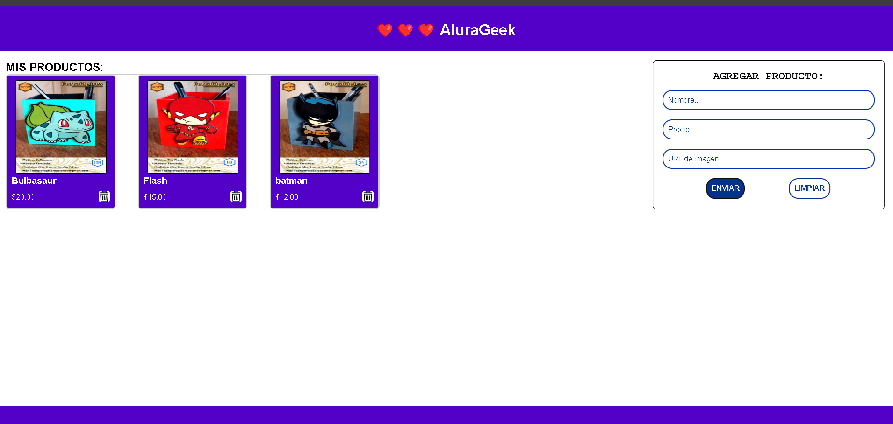
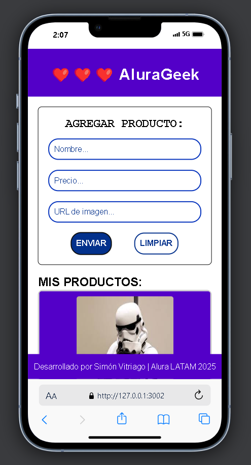

# Challenge ONE | HTML | CSS | JavaScript |Front-end | AluraGeek

## 🖥️ Tecnologías Utilizadas:

- Visual Studio Code
- HTML
- CSS
- JavaScript  

---

---

#### Capturas

1 - Al iniciar en Desktop. 

     

2 - Agregando producto Bulbasaur. 

     

3 - Producto Bulbasaur añadido con éxito. 

     

4 - Tres productos añadidos con éxito. 

     

5 - Visto Mobile. 

     

Link para probar al agregar productos

Nombre: FLash
precio: 10
url: https://sergiorojascreaciones.vercel.app/assets/img/gallery/portalapices-6.jpg

Nombre: Bulbasaur
precio: 15
url: https://sergiorojascreaciones.vercel.app/assets/img/gallery/portalapices-5.jpg

Nombre: Batman
precio: 20
url: https://sergiorojascreaciones.vercel.app/assets/img/gallery/portalapices-8.jpg

Nombre: Michael Jackson
precio: 20
url: https://sergiorojascreaciones.vercel.app/assets/img/gallery/portalapices-10.jpg